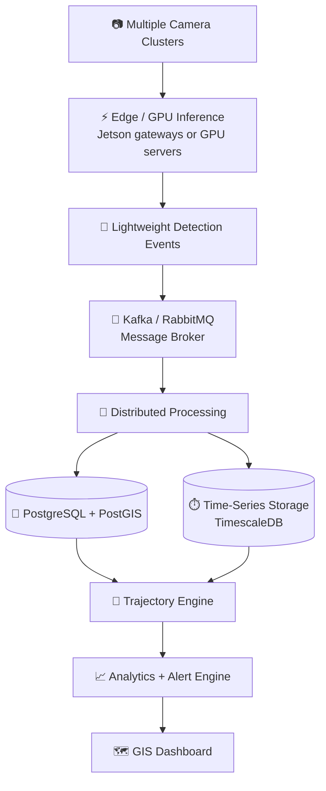
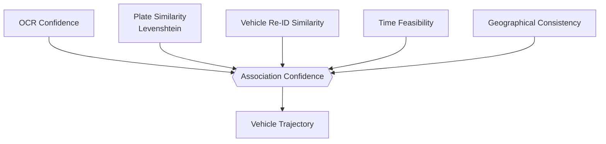

<div align="center">

# 🚦 City-Wide AI Engine for Multi-Camera ANPR Trajectory Tracking & Urban Traffic Analytics

**From isolated plate reads to city-scale vehicle intelligence**


</div>

---

## 📑 Table of Contents

1. [Problem Statement](#-problem-statement)
2. [Our Idea](#-our-idea)
3. [Key Features](#-key-features)
4. [System Architecture](#-system-architecture)
5. [Core Modules](#-core-modules)
6. [Route Anomaly Detection](#-route-anomaly-detection)
7. [Technology Stack](#-technology-stack)
8. [Implemented vs. Scalable Roadmap](#-implemented--demonstrated-vs-production-roadmap)
9. [Results](#-results)
10. [Installation & Usage](#-installation--usage)
11. [Project Structure](#-project-structure)
12. [Impact & Future Scope](#-impact--future-scope)
13. [Team](#-team)

---

## 📌 Problem Statement

| Field | Details |
|---|---|
| **Problem Statement ID** | 26127 |
| **Title** | City-Wide AI Engine for Multi-Camera ANPR Trajectory Tracking and Urban Traffic Analytics |
| **Organization** | Bharat Electronics Limited (BEL) |
| **Category** | Software |
| **Theme** | Smart Automation |

### Background
Modern cities deploy large networks of CCTV and ANPR (Automatic Number Plate Recognition) cameras for traffic management, law enforcement and public security. Most of these systems work in **isolated silos**: they detect plates but do not link data across **space and time**. As a result, authorities cannot automatically track high-interest vehicles across sectors, nor extract macro-level traffic trends from the infrastructure they already own.

### Objective
Build a centralized AI platform that processes multi-camera feeds to deliver:

1. **High-accuracy ANPR/OCR** with **>90% accuracy** in real-world conditions (poor light, weather, angled shots, motion blur, dirty or damaged plates).
2. **Single-plate trajectory tracking**: reconstruct the complete travel path of any vehicle across the city on a GIS map, with timestamps, direction and route.
3. **Macro traffic flow analytics**: traffic density, origin-destination patterns, congestion bottlenecks and real-time heatmaps.
4. **Alert system**: flag blacklisted vehicles and suspicious route anomalies in real time.

---

## 💡 Our Idea

> The system is designed as a progression from AI-based plate recognition to a **city-scale vehicle intelligence platform**. The AI layer converts camera observations into structured events; normalization, fuzzy matching and vehicle Re-ID improve cross-camera identity association; spatial-temporal processing reconstructs vehicle trajectories; GIS and analytics turn individual detections into city-wide traffic intelligence; and a rule-based alert layer identifies configurable blacklist, impossible-travel and duplicate-plate anomalies.

**What makes it different**

- 🎞️ **Events, not video:** cameras are converted into lightweight detection events (plate, timestamp, camera ID, bounding box, confidence, vehicle features), so raw video never floods the central layer.
- 🧠 **Multi-signal identity matching:** a vehicle is associated across cameras using OCR confidence, plate similarity, appearance similarity and time feasibility, never a single exact string match.
- 📏 **Measurable anomaly rules:** "suspicious route" is defined by explicit, configurable rules rather than a vague claim.
- 🗺️ **One dataset, two views:** individual vehicle trajectories and aggregate city-wide traffic patterns on the same GIS layer.

---

## ✨ Key Features

| Module | What it does |
|---|---|
| 🔍 **ANPR / OCR Engine** | Deep-learning plate detection and recognition, robust to blur, angle, weather and damaged plates |
| 🧹 **Plate Normalization** | Cleans raw OCR output (case, spaces, separators, invalid characters, common confusions) before matching |
| 🔗 **Fuzzy Plate Matching** | Levenshtein-based similarity so `MP04AB1238` and `MP04AB123B` can still be linked, guarded by confidence thresholds |
| 🚘 **Vehicle Re-Identification** | Combines plate text with color, type, make/model and appearance embeddings |
| 🧭 **Trajectory Reconstruction** | Query any plate and see its chronological path, timestamps, direction and camera locations on a map |
| 📊 **Traffic Analytics** | Density, average speed, origin-destination patterns, congestion bottlenecks, heatmaps |
| 🚨 **Alert Engine** | Blacklist hits, impossible travel, repeated route / loitering, duplicate (clone) plate |
| 🖥️ **Live Dashboard** | WebSocket-driven real-time detections, alerts, camera status and search |

---

## 🏗️ System Architecture

### Prototype Architecture


### Production City-Scale Architecture



### Detection Event Schema

Cameras emit small structured events instead of video:

```json
{
  "camera_id": "CAM-017",
  "timestamp": "2026-01-15T10:10:42Z",
  "plate_number": "MP04AB1238",
  "bounding_box": [412, 288, 596, 351],
  "confidence": 0.94,
  "vehicle_features": { "type": "car", "color": "white" },
  "latitude": 23.8388,
  "longitude": 78.7378,
  "direction": "NE"
}
```

### Confidence-Based Vehicle Association

No decision is taken from a single signal:



This is far more robust than the naive `OCR → exact string → same vehicle`.

---

## 🧩 Core Modules

### 1. Edge / Inference Layer
- Camera feeds are processed at the edge or on central GPU servers depending on deployment scale.
- Only structured events travel to the central layer, which cuts network traffic and separates video processing from city-wide analytics.
- Large deployments can distribute inference across **NVIDIA Jetson** gateways or GPU inference servers.

### 2. License Plate Normalization
Raw OCR is normalized before matching:
- Upper/lower-case differences
- Spaces and separators
- Invalid characters
- Common OCR substitutions: `0 ↔ O`, `1 ↔ I`, `8 ↔ B`

### 3. Fuzzy Plate Matching

```
Camera A: MP04AB1238
Camera B: MP04AB123B

Exact match:      ❌
Fuzzy similarity: ✓
```

Fuzzy matching **never operates alone**. Confidence thresholds and additional vehicle evidence are used to avoid false associations.

### 4. Vehicle Re-Identification
Plate text is combined with visual characteristics (appearance embedding, color, vehicle type, make/model where reliably detectable, body characteristics):

```
Plate Similarity + Vehicle Appearance Similarity + Temporal Feasibility
                          ↓
              Vehicle Association Confidence
```

Particularly useful when OCR quality varies between cameras.

### 5. Spatial + Temporal Storage
Every detection stores `vehicle_id`, `camera_id`, `timestamp`, `latitude`, `longitude`, `direction`, `confidence`. This enables queries such as:
- Vehicles detected within a geographic region
- Vehicle movement during a time interval
- Camera activity around a location
- Historical trajectory reconstruction

### 6. Real-Time GIS Layer
- Camera nodes → geographic **points**
- Vehicle trajectories → geographic **lines**
- Detection events → **GeoJSON** / vector map layers
- Viewable both as individual trajectories and aggregate city-wide traffic patterns

### 7. Real-Time Dashboard
Delivered over WebSockets so detections and alerts appear without refreshing. Combines: live detections, vehicle search, historical trajectories, camera status, traffic analytics, heatmaps and alerts.

---

## 🚨 Route Anomaly Detection

Instead of "detects suspicious routes", we define **specific, measurable rules**:

### 1️⃣ Impossible Travel / Speed Anomaly
```
Distance(A, B) / Time(A, B) > Maximum plausible speed  →  anomaly
```
Example: Camera A → Camera B, road distance **18 km**, observed time **4 min** → required speed **270 km/h** → flagged as *impossible travel*.

> The system does **not** automatically label this as speeding or criminal activity. It may result from OCR errors, camera timestamp issues or plate cloning.

### 2️⃣ Repeated Route / Loitering Pattern
```
Same vehicle + same geographic zone + N or more visits + within T minutes
        →  configurable repeated-route / loitering alert
```
`N` and `T` are **configurable**, not hard-coded universal thresholds.

### 3️⃣ Possible Duplicate / Ghost Plate
```
Same plate → Camera A at 10:10 → Camera B at 10:14
Required travel time = 35 minutes
        →  Possible duplicate / clone plate event
```

### 4️⃣ Blacklist Alert
A detection matching a watch-listed plate triggers a real-time alert on the dashboard.

---

## 🛠️ Technology Stack

| Layer | Technologies |
|---|---|
| **AI / ML** | ANPR detection + OCR deep-learning models, vehicle Re-ID embeddings |
| **Edge / Inference** | NVIDIA Jetson / edge gateways, GPU inference servers |
| **Backend** | Python (API & services), WebSockets for real-time push |
| **Event Streaming** | Kafka / RabbitMQ *(scalable deployment)* |
| **Database** | PostgreSQL + PostGIS *(spatial)*, TimescaleDB *(time-series, high volume)* |
| **GIS & Maps** | GeoJSON, Leaflet / Mapbox GL / OpenLayers |
| **Frontend** | Web dashboard with live maps, heatmaps and charts |
| **Matching** | Levenshtein distance, confidence-weighted association |

> 📝 *Edit this table to match the exact libraries and frameworks used in your repository.*

---

## ✅ Implemented & Demonstrated vs. Production Roadmap

We clearly separate what is **working today** from what the **production design** adds.

### ✔️ Implemented & Demonstrated
- ANPR / OCR engine with **96% recognition accuracy** in our tests
- Database storing detection records
- Multi-camera tracking
- GIS map visualization
- Dashboard
- Alerts

### 🚀 Production Scalability / Future Enhancement
- Edge deployment on NVIDIA Jetson
- Scalable deployment: **Kafka/RabbitMQ-based event streaming**
- PostGIS / TimescaleDB storage
- Vehicle Re-ID embeddings
- Levenshtein fuzzy matching
- Advanced anomaly scoring
- Large-scale distributed inference

---

## 📈 Results

| Metric | Target (PS) | Achieved |
|---|---|---|
| OCR accuracy | > 90% | **96%** |

> 📝 *Add test conditions (dataset size, lighting/weather mix, number of plates) and screenshots/graphs here so reviewers can verify the result.*

---

## ⚙️ Installation & Usage

> 📝 *Replace the placeholders below with your real commands.*

```bash
# 1. Clone the repository
git clone https://github.com/<your-org>/<your-repo>.git
cd <your-repo>

# 2. Create environment & install dependencies
python -m venv venv
source venv/bin/activate        # Windows: venv\Scripts\activate
pip install -r requirements.txt

# 3. Configure environment
cp .env.example .env            # add DB and camera settings

# 4. Run the backend
python main.py

# 5. Open the dashboard
# http://localhost:8000
```

**Typical workflow**
1. Add camera locations (latitude/longitude) and feeds.
2. Start inference; detection events begin flowing.
3. Search any plate on the dashboard to see its trajectory on the map.
4. Monitor heatmaps, traffic analytics and live alerts.

---

## 📂 Project Structure

```
├── anpr/              # plate detection + OCR
├── matching/          # normalization, fuzzy match, Re-ID
├── trajectory/        # trajectory reconstruction engine
├── analytics/         # density, speed, OD patterns, heatmaps
├── alerts/            # blacklist + anomaly rules
├── backend/           # API + WebSocket server
├── dashboard/         # GIS web dashboard
├── docs/              # architecture diagrams, screenshots
└── README.md
```

> 📝 *Adjust to your actual folder layout.*

---

## 🌍 Impact & Future Scope

**Impact**
- Turns existing CCTV/ANPR infrastructure into an intelligence platform without new hardware.
- Faster tracking of high-interest vehicles for law enforcement.
- Data-driven traffic planning: congestion bottlenecks, origin-destination patterns, flow trends.
- Bandwidth-efficient design suited to city-scale rollout.

**Future scope**
- Learned anomaly scoring on top of rule-based alerts
- Multi-city federation and role-based access control
- Predictive congestion forecasting
- Privacy controls: data retention policies, audit logs

---

## 👥 Team

| Name | Role |
|---|---|
| *Team Name* | *SIH Team ID* |
| *Member 1* | *Role* |
| *Member 2* | *Role* |

---

<div align="center">

**Built for Smart India Hackathon · Problem Statement 26127 · Bharat Electronics Limited**

</div>
